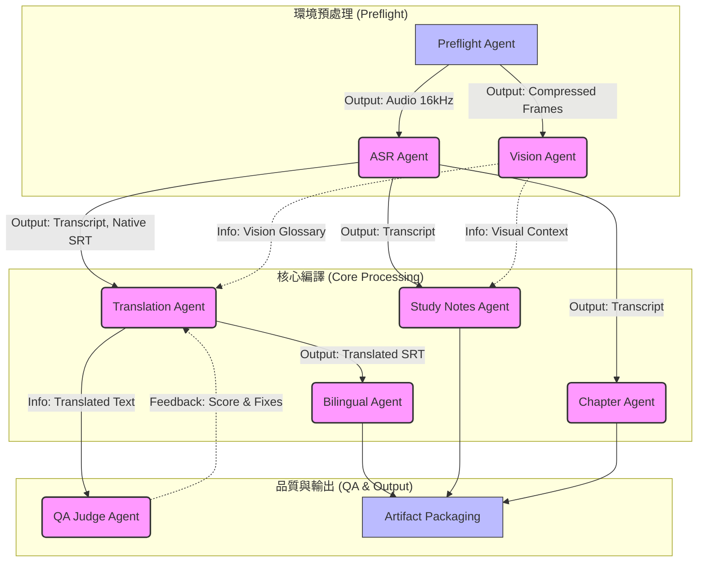

# Subtitle Forge: 多智能體協作藍圖 (Multi-Agent Blueprint)

這是一份將 Subtitle Forge 轉型為「多智能體自動化協作 (Multi-Agent Orchestration)」的架構設計書。

## 1. 流程結構圖 (Workflow Mermaid Diagram)

這個有向無環圖 (DAG) 完美展示了控制流的走向。實線代表強依賴（必須等前者完成），虛線代表信息流（輕度參考）。



## 2. 三大流的明確分工

### 🔄 控制流 (Control Flow)
由底層的**執行引擎 (Director/Foreman)** 絕對控制。
- 引擎讀取 JSON 檔案中的 [dependencies](file:///Users/bryan/main/subtitle-forge/asr_engine.py#32-44)。
- `ASR Agent` 一定在 `Translation Agent` 之前啟動。
- `Vision Agent` 可以跟 `ASR Agent` **完全平行非同步執行**。
- `Study Notes Agent` 必須等待 `ASR` 與 `Vision` 兩者皆完成（Barrier 同步點）才會觸發。

### 📡 信息流 (Information Flow)
- 每個 Agent只負責讀取自己的 `inputs` ，產出 `outputs`，並放回中央黑板 (Blackboard / State Store)。
- 例如：`ASR Agent` 將結果寫入上下文鍵值 `state.transcript_text`。
- 當 `Translation Agent` 啟動時，引擎自動將 `state.transcript_text` 注入給它的 Prompt。

### 🚦 狀態流 (State Flow)
所有的 Agent 都繼承標準的狀態機：
`READY` → `RUNNING`
如果成功：→ `COMPLETED` (引擎釋放鎖定，喚醒下游節點)
如果失敗：→ `FAILED` → 觸發 `Retry Policy` (如果超過次數限制，該節點連同其下游節點進入 `ABORTED`)。

#### 🛡️ Crash-Safe 寫入順序（Phase 10 新增）
為防止進程被 SIGKILL 強制殺死（如 OOM、終端機關閉）導致 API 費用已產生但 `state.json` 未更新的問題，引擎採用以下固定寫入順序：

```
1. _dispatch_action() 完成（API 呼叫成功、磁碟檔案已寫入）
2. state.set_agent_status("COMPLETED")  ← 立即寫入 state.json
3. state.update_outputs(result)         ← 再寫入輸出值
```

若進程在步驟 2 之後、步驟 3 之前被殺死：
- `state.json` 已有 `COMPLETED` 標記 → 下次啟動不觸發重跑
- outputs 值遺失 → `_bootstrap_from_disk` 從磁碟上的 `.srt`、`.zh.srt` 等檔案自動補回
- 整體效果：**零重複 API 呼叫，零資料遺失**

## 3. 節點定義與 JSON 對照表

|智能體 (Agent)|職責 (Role)|所需輸入 (Inputs)|產生輸出 (Outputs)|
|---|---|---|---|
|**ASR Agent**|將音檔精準轉換為文字與時間軸 (Local MLX: Qwen3-ASR)|`audio_path`, [glossary](file:///Users/bryan/main/subtitle-forge/config.py#76-89)|`srt_text`, `transcript`|
|**Vision Agent**|視覺截幀並解譯投影片內容|`video_path`|`frame_paths`, `visual_context`|
|**Translation Agent**|根據語境跟專有名詞進行翻譯|`srt_text`, [glossary](file:///Users/bryan/main/subtitle-forge/config.py#76-89)|`zh_srt_text`|
|**Bilingual Agent**|將雙語時間軸完美合稿|`srt_text`, `zh_srt_text`|`bilingual_srt_text`|
|**Study Notes Agent**|結合影音生成重點 CFA 筆記|`transcript`, `frame_paths`|`study_notes_md`|
|**Chapter Agent**|提煉 LOS 章節標記|`transcript`|`chapter_text`|
|**QA Agent**|負責翻譯品質的 0-10 評分與建議（Session 結束後統一執行，不在翻譯熱路徑中）|`srt_text`, `zh_srt_text`|`qa_score`, `qa_critique`|

---

## 4. 基礎設施與支持層 (Infrastructure & Support)

藍圖中未直接在 DAG（有向無環圖）中標註的檔案，屬於整個系統的「維護、觀察與基礎設施」，它們支撐著所有 Agent 的運作：

### 🛠️ 資源與工具庫 (Services & Utilities)
- **[srt_utils.py](file:///Users/bryan/main/subtitle-forge/srt_utils.py)**: 核心工具庫。所有處理字幕的 Agent 都依賴它進行格式解析、清洗與合稿。
- **[pdf_generator.py](file:///Users/bryan/main/subtitle-forge/pdf_generator.py)**: 輸出服務。由 `Vision/Study Notes Agent` 在最後階段調用，將視覺成果轉化為 PDF 講義。
- **[usage_tracker.py](file:///Users/bryan/main/subtitle-forge/usage_tracker.py)**: 基礎設施 (Infrastructure)。所有 Agent 在進行 AI 請求後，都會向它報告 Token 使用量，負責花費審計與預算控制。

### 🚨 系統恢復與維護 (Ops & Recovery)
- **[recover.py](file:///Users/bryan/main/subtitle-forge/recover.py)**: 系統自癒引擎。當引擎（工頭）發現 DAG 中某個分支失敗時，會自動調度此模組進行偵測與本地修復，確保無縫續傳。
- **[wipe_outputs.py](file:///Users/bryan/main/subtitle-forge/wipe_outputs.py)**: 環境清理工具。用於初始化任務環境，確保 Agent 不會受到舊資料干擾。

### 📊 觀察與介面 (Observability & UI)
- **[check_status.py](file:///Users/bryan/main/subtitle-forge/check_status.py)**: TUI 監控。從外部觀察執行進度網格（黑板狀態的可視化）。
- **[server.py](file:///Users/bryan/main/subtitle-forge/server.py)**: Web 控制台。提供圖形化介面，讓使用者可以跨設備查看所有智能體的執行歷史與成本分析。

這些文件就像是工廠裡的「電路、水路與監控系統」，雖然不直接參與產品加工，但沒有它們，工廠將無法穩定運行。


---

## 5. 2026-04 混合架構更新 (Local-Cloud Hybrid)

目前的架構已升級為 **「本地轉錄 + 雲端推理」** 的混合模式：
- **本地端 (On-premise)**: 負責處理數據量大、較為機械化的任務（如 ASR）。使用 `Qwen3-ASR-1.7B` 確保隱私與零成本。
- **雲端 (Cloud)**: 負責需要高度語言理解與跨模態分析的任務（如翻譯、QA、多模態筆記）。使用 `DeepSeek-V3` 與 `Gemini` 以維持專業產出品質。
